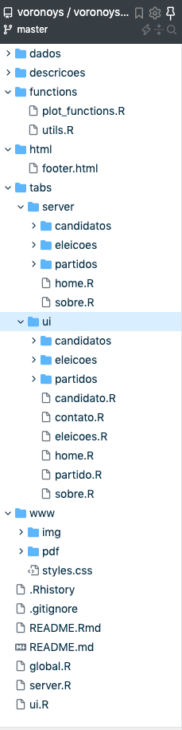

# voronoys shiny详细剖析
- [github repos](https://github.com/voronoys/voronoys_sc)

# website code tree

- 根目录有3个函数，`ui, server, global`，代码都很简短，只是wrapper，分别放了 所有页面基本布局、所有独立页面的source code、packages全局变量以及source code。
- 以上只是wrapper，具体代码在`tabs`文件夹里，每个R代码都是一个独立页面，有自己的输入和输出逻辑。
- `functions`文件夹里有两个通用的绘图和数据处理函数，分工非常明确。
- `www`文件夹里是网站的基本素材（图像、logo、pdf），其中最重要的是`styles.css`，控制了网站所有的格式。
- `html`文件夹里是footer和Google分析的通用html文件，很好修改。
- 其他都是一些可有可无的文件

# 拆解首页
- `ui/home.R`，
- `server/home.R`，

# 拆解一个页面，分析逻辑
 

# 细节
- https://convertico.com/ - png to ico, the small logo in the tab
- [css图片居中(水平居中和垂直居中)](https://www.cnblogs.com/yiven/p/9645686.html)
